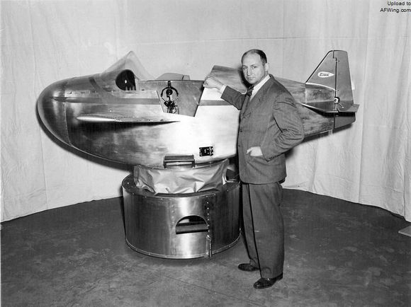
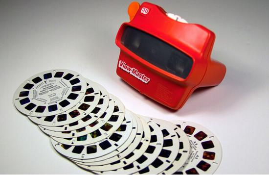
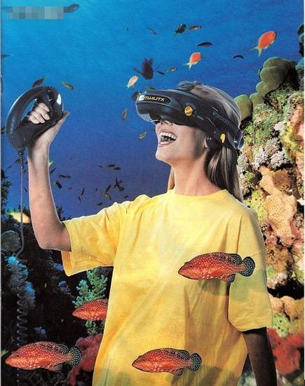
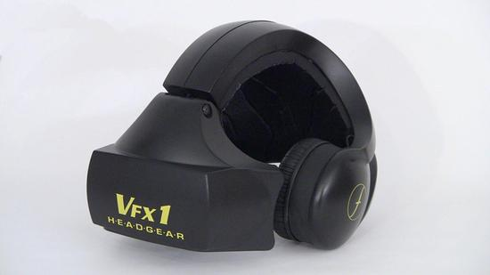

# “远古”时期
## 1929 
- **Link E.A. 飞行模拟器——林克机**

 

## 1939
- **View-Master**

 

## 1946 
- 世界上第一台电子管计算机ENIAC

## 1956 被埋没的天才——Heileg M.
- **Heileg M. 摩托车仿真器——Sensorama** 

 

    - Sensorama的成果
        - 3D摄影和3D投影
        - 拍摄了五部电影：各类交通工具的体验
        - 第五部电影肚皮舞，能闻到香水味
        - 在环球影城投放了一套游戏机，赚了不少。
        - Telesphere Mask头显
    - Sensorama的展望
        - 训练军队、工人、学生
        - 福特公司认为是革命性的产品展示途径
    - Sensorama的失败
        - 过于前卫，当时的视频拍摄技术较差
        - 造价高昂，难以推广
- 晶体管开始应用于计算机

## 1958
- 发明了集成电路(IC)

## 1964
- 美国IBM公司研制成功第一个采用集成电路的通用电子计算机系列

----

# VR的发迹
## 1965
- [**Sutherland  *The ultimate display***](./Papers/The%20ultimate%20display.pdf)

## 1968 第一个真正意义上的VR头显
- **Sutherland *Sword  of  Damocles***
- [世界上第一个MEMS设备](https://patents.google.com/patent/US3413573A/)

----

# 个人计算机和家用游戏机的普及
## 1970s
- Intel i4004
- Intel i8086(x86架构)

## 1981 电子计算机走出象牙塔
- IBM推出个人计算机(PC)用于家庭、办公室和学校。
- 第一个运行于PC上的3D游戏——3D Monster Maze

## 1983
- **DARPA（美国陆军和美国国防部高级项目研究计划局） 分布交互仿真技术——[SIMNET](https://en.wikipedia.org/wiki/SIMNET)**
- 任天堂FC上市

## 1984
- [**McGreevy M. & Humphries J. 虚拟环境视觉显示器**](./Papers/The%20virtual%20environment%20display.pdf)
- 苹果推出第一台Mac电脑Macintosh 128K
    - 9英寸屏幕
    - 128KB RAM
    - 3.5英寸软驱
    - System 1.0
    - 鼠标、键盘、GUI
    - 价格：$2495 

## 1987
- [**Foley *Interfaces for advanced computing***](./Papers/Interfaces%20for%20advanced%20computing.pdf)
- **Lanier J. 提出了VR的概念**

## 1989
- **Quantum 3D公司 [OpenGVS](http://www.sai.msu.su/sal/E/3/OPENGVS.html)**
- CERN（欧洲核子研究组织） 分类互联网信息协议——WWW

---

# 周边技术与硬件革命 VR标准化
## 1990
- **SIGGRAPH会议，提出VR技术研究的主要内容**
    - 实时三维图形生成技术；
    - 多传感器交互技术；
    - 高分辨率显示技术，等。

## 1991
- **[Virtuality](https://en.wikipedia.org/wiki/Virtuality_(gaming))**

 

    - 分辨率：276×372
    - 刷新率：20FPS
    - 售价：$65000

## 1992
- **Sense8公司 [WorldToolKit](http://www8.cs.umu.se/kurser/TDBD12/HT00/lab/wtk/)**
- SGI公司发布OpenGL 1.0

## 1993
- **SEGA推出SEGA VR**

 

- **Heim *Metaphysics of Virtual Reality* 提出VR是一种在效应上而不是事实上真实的事件或实体，同时刻画了VR的七个特征：**
    - 模拟性
    - 交互作用
    - 人工现实
    - 沉浸性
    - 遥在
    - 全身沉浸
    - 网络通信

## 1994
- **Burdea *et,al.* [*Virtual Reality Technology*](./Papers/Book%20review%20of%20Virtual%20Reality%20Technology.pdf)**
    - Immersion 沉浸
    - Interaction 交互
    - Imagination 想象
- **第一届WWW大会 [VRML国际标准](https://www.w3.org/MarkUp/VRML/)**

## 1995
- **任天堂Virtual Boy**

 

    - 没有头部跟踪技术
    - 红色的LED画面让玩家头晕、恶心
- **VFX1**

 
 
    - 双LCD显示器
    - 三种角度动作追踪
    - 立体声扬声器
    - 手持控制器——Cyberpuck
    - 售价：$600
- 3dfx发布了Voodoo 3D加速卡

## 1996 
- 汪成为 [*灵境技术：对逼真性和虚拟性的追求*](./Papers/灵境技术_对逼真性和虚拟性的追求_汪成为.pdf)
- 863计划 [*分布式虚拟环境——DVENET*](./Papers/虚拟现实综述_赵沁平.pdf)
